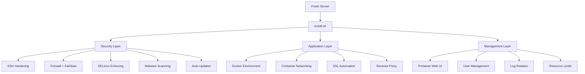
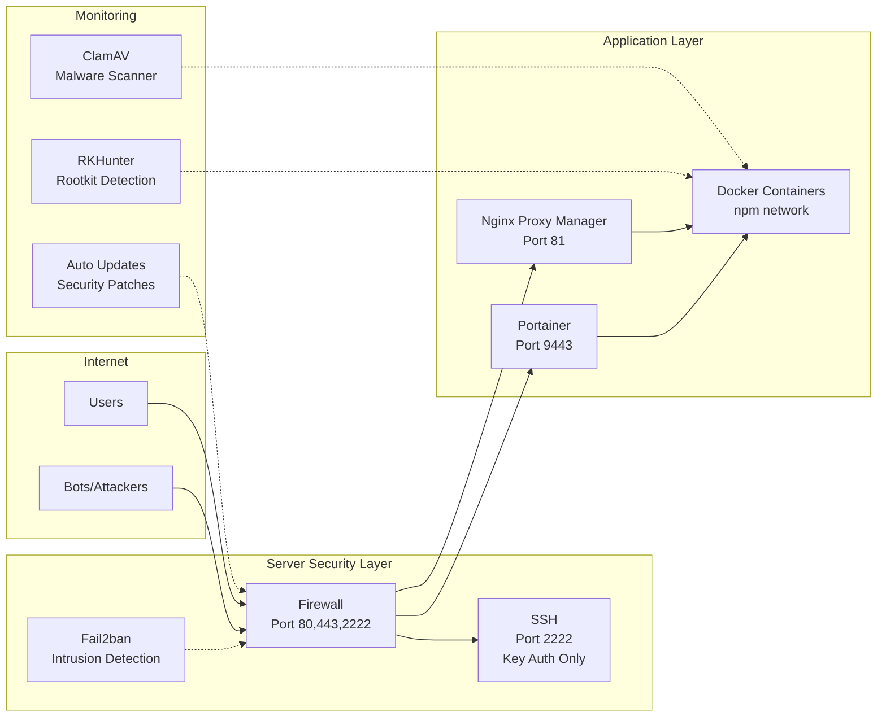
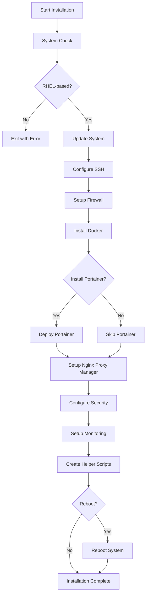
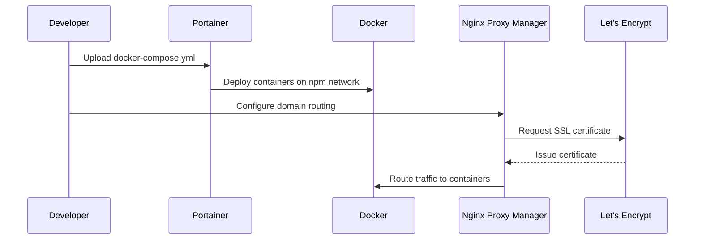

# install.sh - Enterprise-Grade Server Setup Script

[](https://opensource.org/licenses/Apache-2.0)
[](https://www.gnu.org/software/bash/)
[](https://www.redhat.com/en/technologies/linux-platforms/enterprise-linux)
[](https://www.docker.com/)
[](#security-features)
[](https://github.com/ronniebasak/install-sh-rhel-centos-fedora)

> **Skip the server setup tedium. Get a production-ready, security-hardened server foundation in 15 minutes.**

A comprehensive bash script that transforms a fresh RHEL-based server into a secure, Docker-ready production environment with SSL automation, intrusion detection, and enterprise-grade security configurations.

## 🚀 Quick Start

```bash
# One-command installation
curl -sSL https://gist.githubusercontent.com/ronniebasak/1d6bb9c52b5d13d34f7fe4b396b7f202/raw/install.sh | sudo bash

# Or download, review, then run
curl -O https://gist.githubusercontent.com/ronniebasak/1d6bb9c52b5d13d34f7fe4b396b7f202/raw/install.sh
chmod +x install.sh
sudo ./install.sh
```

## 📋 What This Script Provides



### 🔒 Security Features
- **SSH Hardening**: Custom port, key-only authentication, disabled root login
- **Firewall Protection**: Configured firewalld with sensible defaults
- **Intrusion Detection**: Fail2ban with automatic IP blocking
- **Malware Scanning**: ClamAV + RKHunter for ongoing threat detection
- **SELinux**: Enforcing mode for mandatory access control
- **Automatic Updates**: Security patches applied automatically via dnf-automatic

### 🐳 Application Infrastructure
- **Docker Environment**: Latest Docker CE with optimal configurations
- **Container Management**: Portainer web interface for easy deployment
- **SSL Automation**: Nginx Proxy Manager for Let's Encrypt certificates
- **Networking**: Pre-configured `npm` network for seamless container communication
- **Resource Management**: Memory limits and log rotation configured

## 🏗️ Architecture Overview



## 📖 System Requirements

| Component | Requirement |
|-----------|-------------|
| **OS** | Rocky Linux 9, AlmaLinux 9, Fedora 39+ |
| **RAM** | Minimum 2GB (4GB recommended) |
| **Storage** | Minimum 25GB SSD |
| **Network** | Internet connection for package downloads |
| **Access** | Root SSH access |

## 🎯 Installation Flow



## 🚀 Post-Installation Setup

### 1. Access Portainer (if installed)
Navigate to `https://your-server-ip:9443`
- Create admin account
- Select "Docker" environment
- Connect to local Docker socket

### 2. Access Nginx Proxy Manager
Navigate to `http://your-server-ip:81`
- Default login: `admin@example.com` / `changeme`
- **Change password immediately**
- Set up your first SSL certificate

### 3. Create Your First User
```bash
sudo /usr/local/bin/add_secure_user
```

## 💼 Common Use Cases

### Deploy a Web Application


### Database Setup
```bash
# PostgreSQL via Portainer App Templates
# 1. Go to Portainer → App Templates
# 2. Select PostgreSQL
# 3. Configure environment variables
# 4. Deploy on npm network
```

### SSL Certificate Automation
```bash
# Nginx Proxy Manager handles this automatically
# 1. Add domain A record pointing to server IP
# 2. Create proxy host in NPM
# 3. Request Let's Encrypt certificate
# 4. Auto-renewal every 90 days
```

## 🛠️ Management Commands

### User Management
```bash
# Add secure user with Docker access
sudo /usr/local/bin/add_secure_user

# List users with Docker access
getent group docker
```

### Firewall Management
```bash
# Open port
sudo firewall-cmd --permanent --add-port=8080/tcp
sudo firewall-cmd --reload

# Check firewall status
sudo firewall-cmd --list-all
```

### Container Operations
```bash
# View running containers
docker ps

# Check container logs
docker logs container-name

# Access container shell
docker exec -it container-name bash
```

### Security Monitoring
```bash
# Check SSH attempts
sudo tail -f /var/log/secure

# Fail2ban status
sudo fail2ban-client status

# Malware scan results
sudo tail /var/log/clamav/freshclam.log
```

## 🔧 Troubleshooting

### SSH Connection Issues
```bash
# Check SSH service on custom port
sudo systemctl status sshd
sudo ss -tlnp | grep :2222

# Connect with custom port
ssh -p 2222 username@server-ip
```

### Container Issues
```bash
# Check container logs
docker logs container-name

# Inspect npm network
docker network inspect npm

# Check port conflicts
sudo netstat -tlnp | grep :8080
```

### SSL Certificate Problems
```bash
# Verify domain DNS
dig example.com

# Check NPM logs
docker logs nginx-proxy-manager-app-1

# Ensure port 80 is accessible
sudo firewall-cmd --list-ports
```

## 📊 Resource Usage

| Service | RAM Usage | CPU Usage | Storage |
|---------|-----------|-----------|---------|
| Docker Daemon | ~100MB | Low | Variable |
| Portainer | ~50MB | Very Low | ~500MB |
| Nginx Proxy Manager | ~30MB | Low | ~200MB |
| Firewall/Security | ~20MB | Very Low | ~100MB |
| **Total Overhead** | **~200MB** | **Low** | **~800MB** |

## 🌟 Benefits Over Alternatives

### vs. Manual Setup
- ✅ 15 minutes vs. weekend project
- ✅ Consistent, tested configuration
- ✅ No missed security steps
- ✅ Documented and reproducible

### vs. Cloud Platforms
- ✅ $20/month vs. $1,200+/month
- ✅ No vendor lock-in
- ✅ Full control and customization
- ✅ Predictable costs

### vs. Enterprise Solutions
- ✅ Zero licensing costs
- ✅ Simple deployment
- ✅ No complex enterprise overhead
- ✅ Perfect for small-medium teams

## 🤝 Contributing

We welcome contributions! Please see [CONTRIBUTING.md](CONTRIBUTING.md) for guidelines.

- 🐛 **Bug Reports**: Use GitHub Issues
- ✨ **Feature Requests**: Use GitHub Issues with enhancement label
- 📖 **Documentation**: Submit PRs for improvements
- 🧪 **Testing**: Help test on different RHEL distributions

## 📄 License

This project is licensed under the Apache License 2.0 - see the [LICENSE](LICENSE) file for details.

## 🙏 Acknowledgments

- **Rocky Linux & AlmaLinux** teams for RHEL-compatible distributions
- **Docker** team for containerization platform
- **Portainer** team for Docker management UI
- **Nginx Proxy Manager** team for SSL automation
- **Let's Encrypt** for free SSL certificates

## 📞 Support & Contact

- **Issues**: [GitHub Issues](https://github.com/ronniebasak/install-sh-rhel-centos-fedora/issues)
- **Discussions**: [GitHub Discussions](https://github.com/ronniebasak/install-sh-rhel-centos-fedora/discussions)
- **Twitter**: [@HiSohan](https://x.com/HiSohan)
- **Script Source**: [GitHub Gist](https://gist.github.com/ronniebasak/1d6bb9c52b5d13d34f7fe4b396b7f202)

---

<div align="center">

**⭐ Star this repository if it saved you time!**

[🚀 Get Started](#-quick-start) • [📖 Documentation](https://github.com/ronniebasak/install-sh-rhel-centos-fedora/wiki) • [🐛 Report Bug](https://github.com/ronniebasak/install-sh-rhel-centos-fedora/issues) • [💡 Request Feature](https://github.com/ronniebasak/install-sh-rhel-centos-fedora/issues)

</div>